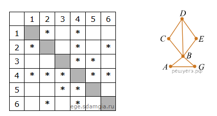
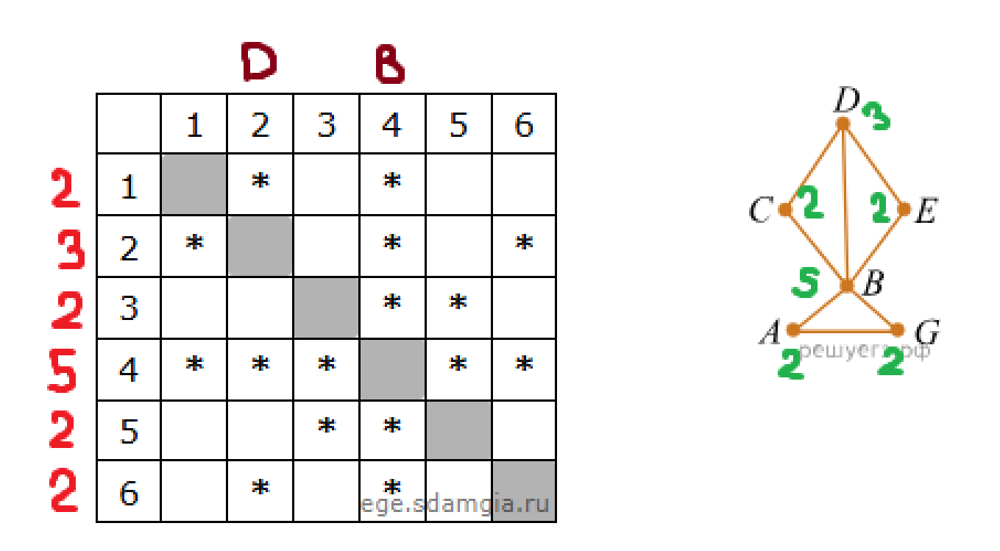
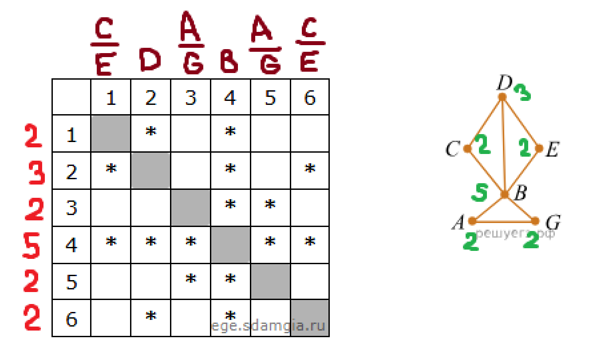

#ИНФОРМАТИКА
Задание про графы

---

## Пример

### Задание
На рисунке справа схема дорог Н-⁠ского района изображена в виде графа, в таблице содержатся сведения о дорогах между населенными пунктами (звездочка означает, что дорога между соответствующими городами есть).

Так как таблицу и схему рисовали независимо друг от друга, то нумерация населённых пунктов в таблице никак не связана с буквенными обозначениями на графе. Определите номера населенных пунктов _A_ и _G_ в таблице. В ответе запишите числа в порядке возрастания без разделителей.

### Решение
1. Для начала отметим в таблице и на графике кол-во пересечений у каждой точки. И соотнесём уникальные точки по кол-ву пересечений *(будем называть это число индексом)* с табличными.
   

2. Сделаем предположение о нахождении точек, так как граф симметричен. Точка `D` пересекается только с `B`, `C`, `E`, таким образом можем предположить их положения `1/6 - С/E` => `3/5 - A/G` *(оставшиеся точки)*.
   

3. По заданию нам нужно найти номера городов `A` и `G`. Они находятся под номерами `3` и `5`. Ответом будет: `35`
   